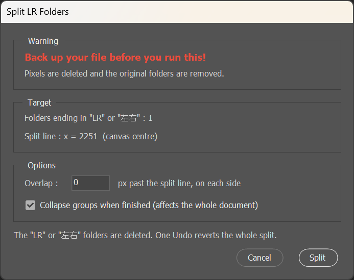

# PSLayerLRSplitter

[English README](README.md)

**[Live2D](https://www.live2d.com/) 向けキャラクターイラストの「パーツ分け／素材分け」
作業を自動化する Adobe Photoshop 用スクリプト（ExtendScript / `.jsx`）です。**

Live2D Cubism でモデリングするキャラクターイラストは、耳・目・眉・腕・髪束などの
左右対称パーツが 1 枚の絵として描かれていることが多く、PSD を Cubism Editor に
取り込む前に左右へ分離する必要があります。

手作業だと、パーツの数だけ「グループを複製 → 片側を範囲選択 → 削除 → フォルダー名を
変更 → 『のコピー』が付いたレイヤー名を戻す」を繰り返すことになります。このスクリプトは
ドキュメント内の対象フォルダーをまとめて処理し、垂直の分割線で切り分けます。
クリッピングマスク・描画モード・レイヤー名はそのまま維持されます。

## 何をするか

名前が左右サフィックスで終わるフォルダーを、自分自身の複製 2 つに置き換え、
それぞれを分割線の片側だけに切り詰めます。

```
*耳LR                      *耳L          （画面の右半分）
  耳線画                     耳線画
  耳影          ------>      耳影
  耳塗り                     耳塗り
                           *耳R          （画面の左半分）
                             耳線画
                             耳影
                             耳塗り
```

出力は元フォルダーの複製なので、**クリッピングマスク・描画モード・不透明度・
重ね順**はそのまま引き継がれます。Photoshop はグループを複製すると中のレイヤー名に
「のコピー」を付けてしまうため、複製前に元の名前を記録しておき、複製後に書き戻します。

### 左右は画面と反転します

サフィックスは**キャラクターから見た左右**を表します。`L` はキャラクターの左、
つまり画面上では**右側**です。

| サフィックス | 出力 | 残る領域 |
|---|---|---|
| `LR` | `L` | 画面の右半分 |
| | `R` | 画面の左半分 |
| `左右` | `左` | 画面の右半分 |
| | `右` | 画面の左半分 |

大文字小文字は区別し、対象は**フォルダーのみ**です（`耳LR` という名前のレイヤーは
処理しません）。判定は末尾のみなので、`*` や連番などの接頭辞はそのまま保持されます。

## 機能

- `LR` と `左右` の両方のサフィックスに対応
- ドキュメントに**縦ガイド**があればその位置で、無ければキャンバス中心で分割
- 範囲外のピクセルを削除するため、Cubism にそのまま取り込める PSD になります
- 複製で崩れるレイヤー名を、元の名前に書き戻します
- **オーバーラップ**（px）を指定可能。分割線を越えて各半分を伸ばし、パーツが
  動いたときの継ぎ目を目立たなくします
- 完了後にグループを畳むオプション（レイヤーパネルが見やすい状態に戻ります）
- テキスト・スマートオブジェクト・塗りつぶしレイヤーは自動でラスタライズします
- **進捗バー**を表示します。処理中のレイヤー名も出るので、大きなドキュメントでも
  フリーズしたように見えません
- **入れ子になった対象フォルダーを実行前に警告**し、パスで一覧表示します。
  該当フォルダーは親と一緒に切られるだけで単独では分割されないため、命名ミスに
  気づけます
- 処理全体が 1 つのヒストリー状態になるため、**Undo 1 回で元に戻せます**
- 実行結果を集計表示：分割したフォルダー数、処理レイヤー数、スキップした
  レイヤー、空になったフォルダー

### 実行画面



## 動作環境

ExtendScript が動作する Adobe Photoshop（CS6 〜 近年の CC 相当）。Windows /
macOS 両対応です。ソースは ASCII のみ（日本語は `\u` エスケープで記述）なので、
Photoshop 側の文字コード判定に影響されません。

## インストール

### 方法 A: スクリプトメニューに登録する（推奨）

`PSLayerLRSplitter.jsx` を Photoshop の `Presets/Scripts` フォルダーにコピーします。

- **Windows:** `C:\Program Files\Adobe\Adobe Photoshop <バージョン>\Presets\Scripts\`
- **macOS:** `/Applications/Adobe Photoshop <バージョン>/Presets/Scripts/`

Photoshop を再起動すると
**ファイル → スクリプト → PSLayerLRSplitter** から実行できます。

### 方法 B: インストールせずに実行する

**ファイル → スクリプト → 参照...** から `PSLayerLRSplitter.jsx` を選びます。

## 使い方

> **実行前にバックアップを取ってください。** ピクセルを削除し、元のフォルダーも
> 削除します。Undo 1 回で戻せますが、保存済みのコピーがある方が安全です。

1. 分割したいフォルダーの名前を `LR` または `左右` で終わるようにします。
2. キャラクターがキャンバス中央にない場合は、対称軸に**縦ガイドを 1 本**引きます。
3. スクリプトを実行します。
4. 必要ならオーバーラップを設定し、**Split** を押します。

元の `LR` / `左右` フォルダーは削除されます。Undo 1 回で復元できます。

## Cubism への取り込みについて

分割自体が破壊的な処理なので、結果はそのまま Cubism に取り込めます。

ただし **Cubism Editor は PSD のレイヤーマスクを一切読みません。** 元ファイルの
レイヤーに既にマスクが付いている場合は、取り込み前に「レイヤーマスクを適用」して
ください。マスクが残ったままの PSD は取り込みが崩れることがあります。

## 仕様上の注意

- **フォルダーの開閉状態は復元できません。** Photoshop は
  `layerSectionExpanded` を読み取り専用のプロパティとしてのみ公開しており、
  個別のグループを開閉するスクリプトコマンドがありません。**Collapse groups
  when finished** オプションが唯一の代替手段ですが、分割したフォルダーだけでなく
  **ドキュメント内の全グループ**が畳まれます。
- 各系統で**最も外側**の該当フォルダーのみ処理します。`LR` フォルダーが入れ子に
  なっている場合、内側は親と一緒に切られるだけで、単独では分割されません。
  実行前のダイアログで入れ子の該当フォルダーをパス付きで一覧表示し、結果
  ダイアログでも再度報告するので、命名ミスであれば気づいて直せます。
- 調整レイヤーはスキップします（通常は切り詰め済みのレイヤーにクリッピング
  されているため）。
- 絵が分割線をまたがないフォルダーでも両側が生成されます。空になった方は結果
  ダイアログに一覧表示されるので、確認して削除してください。

## 関連ツール

このスクリプトが担当するのは工程のごく一部です。Live2D 公式の以下 2 つが同じ
ワークフロー上の隣接位置にありますが、いずれも代替にはなりません。

- **[素材分け Photoshop プラグイン](https://www.live2d.com/cubism/download/material-separation-ps-plugin/)**
  — 1 枚絵からパーツを切り出す際の、AI による切り抜き・塗りつぶし・透明部分の
  補完を補助します。解いているのは**塗りの生成**の問題であって、左右分割では
  ありません。Cubism PRO ライセンスが必要です。
- **Live2D_Preprocess** — グループを自動的に**結合**し、PSD を 1 パーツ 1 レイヤーに
  まとめる公式 Photoshop スクリプトです。本スクリプトの**後段**に位置するもので、
  置き換えるものではありません。
  [Cubism マニュアル（インポート用のPSDの作り方）](https://sites.google.com/cybernoids.jp/cubism2/editor/modeler/texture/psd)を参照してください。

調べた限り、左右分割そのものを行う既存ツールは見当たりませんでした。汎用の
「Split to Layers」系スクリプトは連続したピクセル塊ごとに分離するもので、
目的が異なります。

## ライセンス

[MIT](LICENSE)
